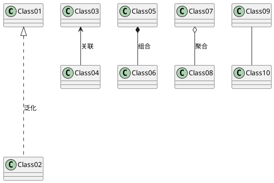

# PlantUML类图 语法

* Class01 <|-- Class02:泛化
* Class03 <-- Class04:关联
* Class05 *-- Class06:组合
* Class07 o-- Class08:聚合
* Class09 -- Class10

-- 实线
.. 虚线
 >  "-","." 的数量 可以表示长度

```plantuml

@startuml

Class01 <|.... Class02:泛化
Class03 <-- Class04:关联
Class05 *-- Class06:组合
Class07 o-- Class08:聚合
Class09 -- Class10

@enduml


```