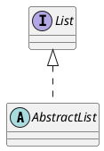

# MyLearnNote

* [WVJSBridge](WebViewJavaScriptBridge/WVJSBridge.md)
* [Plantuml](Plantuml/Plantuml.md)

```plantuml
@startuml

abstract class AbstractList
interface List
List <|.. AbstractList

@enduml
```
