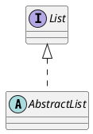

# MyLearnNote

* [WVJSBridge](index/WebViewJavaScriptBridge/WVJSBridge.md)
* [Plantuml](index/Plantuml/Plantuml.md)
* [一些笔记](index/iOS/dictionary.md)
* [UML](index/UML/UML_.md)

```plantuml
@startuml

abstract class AbstractList
interface List
List <|.. AbstractList

@enduml
```
