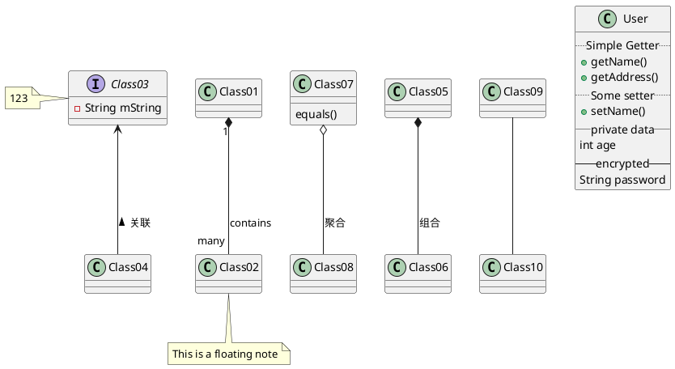
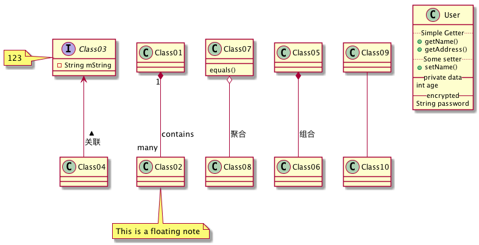

# PlantUML类图 语法

### 类关系
* Class01 <|-- Class02:泛化
* Class03 <-- Class04:关联
* Class05 *-- Class06:组合
* Class07 o-- Class08:聚合
* Class09 -- Class10

### 变量方法的定义
*  \- ： private
*  \# ： protected
*  \~ ： package private
*  \+ ： public

-- 实线
.. 虚线
 >  "-","." 的数量 可以表示长度

```


