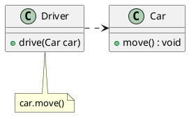
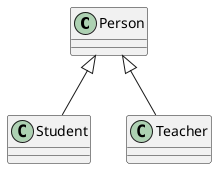
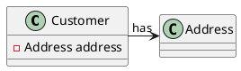
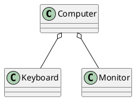
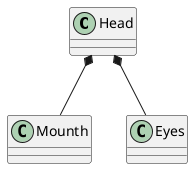

# UML 基础

## 依赖
依赖关系(Dependency) 是一种使用关系。



```
class Driver {
  - (void)drive:(Car *)car {
    [car move];
  }
  ...
}

class Car {
  - (void)move {
    ...
  }
}
```

依赖关系有如下三种情况：
1. A类是B类中的（某中方法的）局部变量；
2. A类是B类方法当中的一个参数；
3. A类向B类发送消息，从而影响B类发生变化；

总结就是，A的改变会影响到B。

## 泛化关系
泛化关系（Generalization）：A是B和C的父类，B,C具有公共类（父类）A，说明A是B,C的一般化（概括，也称泛化） (继承)



```
class Persion {}
class Student : Person {}
class Teacher : Person {}
```

在UML当中，对泛化关系有三个要求：
1. 子类与父类应该完全一致，父类所具有的属性、操作，子类应该都有；
2. 子类中除了与父类一致的信息以外，还包括额外的信息；
3.  可以使用父类的实例的地方，也可以使用子类的实例；

## 关联关系
关联关系（Association）:类之间的联系


## 聚合关系
聚合关系（Aggregation）:表示的是整体和部分的关系，
**整体与部分 可以分开**.


## 组合关系
组合关系（Composition）:也是整体与部分的关系，但是**整体与部分不可以分开**.



所表现的强弱程度依次为：组合>聚合>关联>依赖。