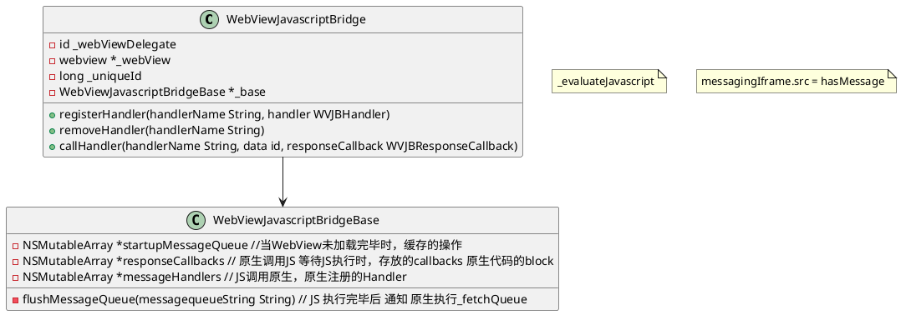

### WebViewJavascriptBridge



### 原生调用JS
最终都是通过调用基础接口 _evaluateJavascript 实现的。

### JS调用原生
```
sendMessageQueue.push(message);
messagingIframe.src = CUSTOM_PROTOCOL_SCHEME + '://' + QUEUE_HAS_MESSAGE;
```
通过改变iframe 通知原生更改。然后原生在webview 截取
