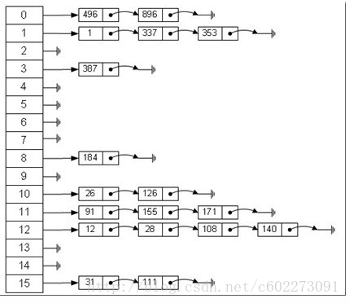

# NSDictionary 实现 模拟

## 实现 方式

底层实现 hash table

字典底层实现模拟(数组+链表)


优点
* 用key生成hashcode，将value放在hashcode 对应的链表中。
* hashCode数字过大，会经过取余生成一个较小的数字。为防止value被覆盖，使用链表，在链尾插入。
* 使用链表原因，插入删除频繁。
* 这样，key值取余得到值相等的键值对，都将保存在同一个链表数组中，当查找key对应的值时，首先获取到该链表数组，然后遍历该数组，取正确的key所对应的值即可。

全部过程
1. 根据 key 计算出它的哈希值 h。
2. 假设箱子的个数为 n，那么这个键值对应该放在第 (h % n) 个箱子中。
3. 如果该箱子中已经有了键值对，就使用开放寻址法或者拉链法解决冲突。


<div  align="center">  
<!--  -->

</div>


# NSArray 

在内存中是连续的
__NSArrayM的结构定义为:
```
@interface __NSArrayM : NSMutableArray {
    NSUInteger _used; //个数
    NSUInteger _offset; // 实际数组偏移
    int _size:28; // 分配的大小
    int _unused:4;
    uint32_t _mutations; //修改标记
    id *_list;
}
@end
```

# NSSet

hash表，相同的对象 只保存一份